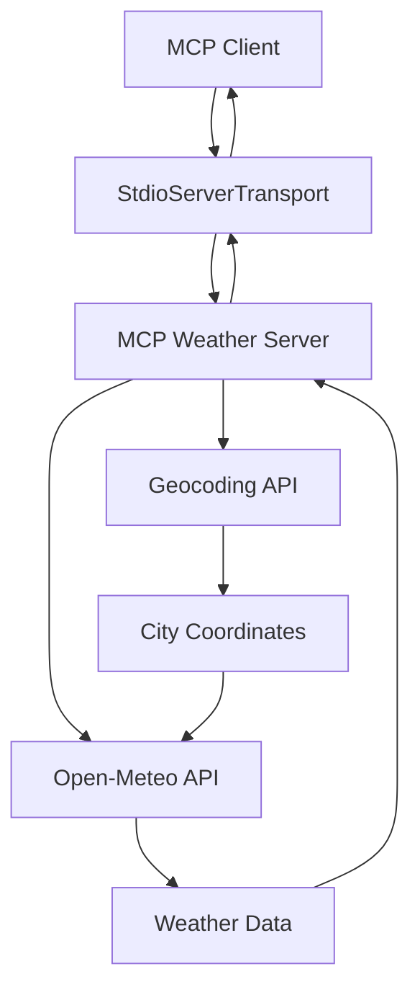

# MCP Weather Server 🌤️

A Model Context Protocol (MCP) server that provides real-time weather data for any city worldwide using the Open-Meteo API.

## 🚀 Features

- **Real-time Weather Data**: Get current weather conditions for any city
- **MCP Protocol Compliance**: Fully compatible with the Model Context Protocol
- **Error Handling**: Graceful handling of invalid city names
- **TypeScript Support**: Written in TypeScript for better type safety
- **Stdio Transport**: Uses standard input/output for communication
- **Geocoding Integration**: Automatically resolves city names to coordinates

## 📋 Prerequisites

- Node.js (v18 or higher)
- npm or yarn package manager
- TypeScript support

## 🛠️ Installation

1. Clone the repository:
```bash
git clone https://github.com/ParthibanRajasekaran/mcp-weather.git
cd mcp-weather
```

2. Install dependencies:
```bash
npm install
```

3. Build the project (optional):
```bash
npm run build
```

## 🎯 Usage

### Running the Server

#### Development Mode
```bash
npm run dev
```

#### Production Mode
```bash
npm run build
npm start
```

### MCP Configuration

Add the following configuration to your MCP client's configuration file (`.vscode/mcp.json`):

```json
{
    "servers": {
        "my-weather-server": {
            "type": "stdio",
            "command": "npx",
            "args": [
                "-y",
                "tsx",
                "weather/main.ts"
            ]
        }
    }
}
```

### Available Tools

#### `getWeather`
Get current weather data for a specified city.

**Parameters:**
- `city` (string): The name of the city to get weather for

**Example Usage:**
```typescript
// MCP client call
const weather = await mcpClient.callTool("getWeather", { city: "London" });
```

**Response Format:**
```json
{
  "latitude": 51.51147,
  "longitude": -0.13078308,
  "current": {
    "time": "2025-07-08T06:15",
    "temperature_2m": 13.9,
    "apparent_temperature": 11,
    "is_day": 1,
    "rain": 0
  },
  "hourly": {
    "time": [...],
    "temperature_2m": [...]
  }
}
```

## 🏗️ Architecture

### Transport Layer
The server uses **StdioServerTransport** for communication:
- **Input**: Standard input (stdin)
- **Output**: Standard output (stdout)
- **Protocol**: JSON-RPC over stdio
- **Benefits**: Simple, reliable, and widely supported

### MCP Inspector Integration
For debugging and development, you can use the MCP Inspector:

1. Install the MCP Inspector:
```bash
npm install -g @modelcontextprotocol/inspector
```

2. Run the inspector:
```bash
npx @modelcontextprotocol/inspector npx tsx weather/main.ts
```

3. Open the inspector in your browser at `http://localhost:5173`

### Data Flow



## 📁 Project Structure

```
mcp-weather/
├── weather/
│   └── main.ts          # Main server implementation
├── .vscode/
│   └── mcp.json         # MCP client configuration
├── package.json         # Project dependencies and scripts
├── tsconfig.json        # TypeScript configuration
├── README.md           # This file
└── .gitignore          # Git ignore rules
```

## 🔧 Configuration

### Environment Variables
Currently, no environment variables are required as the server uses free APIs.

### TypeScript Configuration
The project uses modern TypeScript settings:
- **Target**: ES2022
- **Module**: ESNext
- **Strict Mode**: Enabled
- **Output**: `./dist` directory

### API Endpoints
- **Geocoding**: `https://geocoding-api.open-meteo.com/v1/search`
- **Weather**: `https://api.open-meteo.com/v1/forecast`

## 🧪 Development

### Running Tests
```bash
npm test
```

### Development Scripts
- `npm run dev` - Run in development mode with hot reload
- `npm run build` - Build the TypeScript project
- `npm start` - Run the built project

### Debugging
1. Use the MCP Inspector (see above)
2. Check logs in the terminal where the server is running
3. Verify MCP client configuration

## 🌐 API Details

### Geocoding API
- **Service**: Open-Meteo Geocoding API
- **Rate Limit**: Free tier, no authentication required
- **Response**: City coordinates and metadata

### Weather API
- **Service**: Open-Meteo Weather API
- **Rate Limit**: Free tier, no authentication required
- **Model**: UKMO Seamless (UK Met Office)
- **Data**: Current conditions and hourly forecasts

## 🤝 Contributing

1. Fork the repository
2. Create a feature branch: `git checkout -b feature/amazing-feature`
3. Commit your changes: `git commit -m 'Add amazing feature'`
4. Push to the branch: `git push origin feature/amazing-feature`
5. Open a Pull Request

## 📄 License

This project is licensed under the MIT License - see the [LICENSE](LICENSE) file for details.

## 🙏 Acknowledgments

- [Model Context Protocol](https://github.com/modelcontextprotocol/specification) for the protocol specification
- [Open-Meteo](https://open-meteo.com/) for the free weather API
- [TypeScript](https://www.typescriptlang.org/) for type safety

## 📞 Support

If you encounter any issues or have questions:
1. Check the [Issues](https://github.com/ParthibanRajasekaran/mcp-weather/issues) page
2. Create a new issue with detailed information
3. Contact: rajasekaran.parthiban7@gmail.com

## 🔄 Changelog

### v1.0.0
- Initial release
- Basic weather data retrieval
- MCP protocol compliance
- TypeScript implementation
- Stdio transport support

---

Made with ❤️ by [ParthibanRajasekaran](https://github.com/ParthibanRajasekaran)
const server = new McpServer({
    name: "MCP Weather Server",
    version: "1.0.0",
    description: "A server that provides weather data"
});
```

## 🔧 Tools Available

### `getWeather`

Retrieves current weather conditions and forecasts for a specified city.

**Parameters:**
- `city` (string): The name of the city to get weather data for

**Returns:**
- Current temperature, apparent temperature, and conditions
- Hourly temperature forecast for the next 7 days
- Location coordinates and timezone information

**Example Usage:**
```typescript
// Through MCP client
const weatherData = await mcpClient.callTool("getWeather", { city: "London" });
```

## 📁 Project Structure

```
mcp-weather/
├── .vscode/
│   └── mcp.json              # MCP server configuration
├── weather/
│   └── main.ts               # Main server implementation
├── package.json              # Dependencies and scripts
├── tsconfig.json             # TypeScript configuration
└── README.md                 # This file
```

## 🔍 MCP Inspector Integration

To use with the MCP Inspector for debugging and development:

1. **Configure MCP Client**: Add the server to your MCP configuration file (`.vscode/mcp.json`):

```json
{
    "servers": {
        "my-weather-server": {
            "type": "stdio",
            "command": "npx",
            "args": ["-y", "tsx", "weather/main.ts"]
        }
    }
}
```

2. **Launch Inspector**: The server can be inspected using MCP-compatible tools and inspectors.

3. **Debug Mode**: Use the development server for real-time debugging:
```bash
npm run dev
```

## 🌐 API Integration

The server integrates with two Open-Meteo APIs:

### Geocoding API
- **Endpoint**: `https://geocoding-api.open-meteo.com/v1/search`
- **Purpose**: Convert city names to coordinates
- **Features**: Multi-language support, fuzzy matching

### Weather API
- **Endpoint**: `https://api.open-meteo.com/v1/forecast`
- **Purpose**: Retrieve weather data using coordinates
- **Model**: UK Met Office Seamless model (`ukmo_seamless`)
- **Data**: Current conditions + hourly forecasts

## 🛠️ Development

### Available Scripts

```bash
# Development server with hot reload
npm run dev

# Build TypeScript to JavaScript
npm run build

# Start production server
npm start

# Run tests
npm test
```

### Adding New Features

1. **New Tools**: Add tools to the server using the `server.tool()` method
2. **Enhanced Data**: Extend the weather API calls to include more parameters
3. **Error Handling**: Improve error handling for edge cases

## 🌍 Usage Examples

### Basic Weather Query

```typescript
// Get weather for London
const result = await getWeather({ city: "London" });

// Current conditions
console.log(`Temperature: ${result.current.temperature_2m}°C`);
console.log(`Feels like: ${result.current.apparent_temperature}°C`);
console.log(`Rain: ${result.current.rain}mm`);
```

### Multi-City Comparison

```typescript
const cities = ["London", "Paris", "New York", "Tokyo"];
const weatherData = await Promise.all(
    cities.map(city => getWeather({ city }))
);
```

## 🔐 Error Handling

The server includes comprehensive error handling:

- **Invalid Cities**: Returns helpful error messages for non-existent cities
- **API Failures**: Graceful handling of network issues
- **Data Validation**: Input validation using Zod schemas

## 📊 Data Schema

### Current Weather Response

```typescript
interface WeatherResponse {
    latitude: number;
    longitude: number;
    timezone: string;
    current: {
        time: string;
        temperature_2m: number;
        apparent_temperature: number;
        is_day: number;
        rain: number;
    };
    hourly: {
        time: string[];
        temperature_2m: number[];
    };
}
```

## 🤝 Contributing

1. Fork the repository
2. Create a feature branch (`git checkout -b feature/amazing-feature`)
3. Commit your changes (`git commit -m 'Add amazing feature'`)
4. Push to the branch (`git push origin feature/amazing-feature`)
5. Open a Pull Request

## 📝 License

This project is licensed under the ISC License - see the [LICENSE](LICENSE) file for details.

## 🙏 Acknowledgments

- [Open-Meteo](https://open-meteo.com/) for providing free weather data
- [Model Context Protocol](https://modelcontextprotocol.io/) for the MCP specification
- UK Met Office for the weather model data

## 📞 Support

For questions or issues:
- Create an issue on GitHub
- Check the [MCP Documentation](https://modelcontextprotocol.io/docs)

---

Built with ❤️ using the Model Context Protocol
